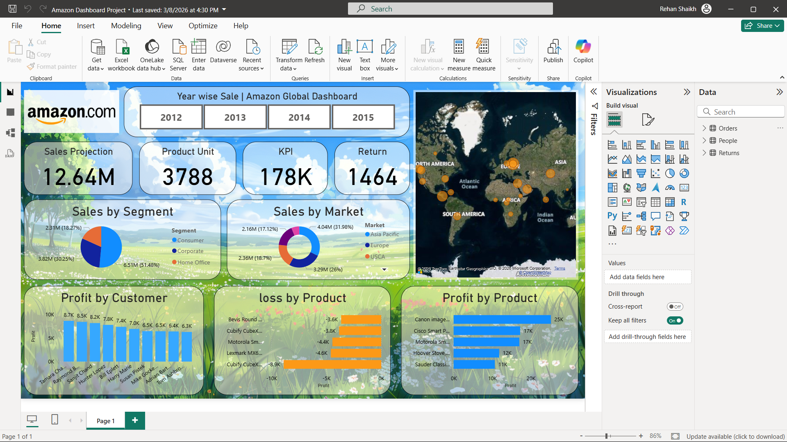

# Amazon Sales Dashboard 📊

An interactive Power BI dashboard designed to analyze global sales performance, customer segments, and product-level profitability.

---

## 🎯 Objective
To explore sales trends, identify high-performing markets, and analyze profit distribution across products and customer segments.

---

## 📊 Key KPIs
- Total Sales: 12.64M  
- Total Units Sold: 3,788  
- Total Profit: 178K  
- Total Returns: 1,464  

---

## 🔍 Key Insights
- A small group of products contributes significantly to overall profit  
- Several products consistently generate losses, impacting overall performance  
- Consumer segment dominates total sales compared to corporate and home office  
- Asia Pacific and USCA regions show strong sales contribution  

---

## 📈 Dashboard Features
- Year-wise sales filtering for trend analysis  
- Product-level profit and loss comparison  
- Market and segment-based sales distribution  
- Global sales visualization using map-based insights  

---

## 🛠 Tools & Technologies
- Power BI  
- DAX  
- Data Cleaning & Transformation  

---

## 🖼 Dashboard Preview

---

## 📁 Files
- amazon-sales-dashboard.pbix  

---

## ⚠️ Note
This project focuses on exploratory data analysis and visualization of global sales data for learning and portfolio purposes.

---

## 👤 Author
Rehan Shaikh
